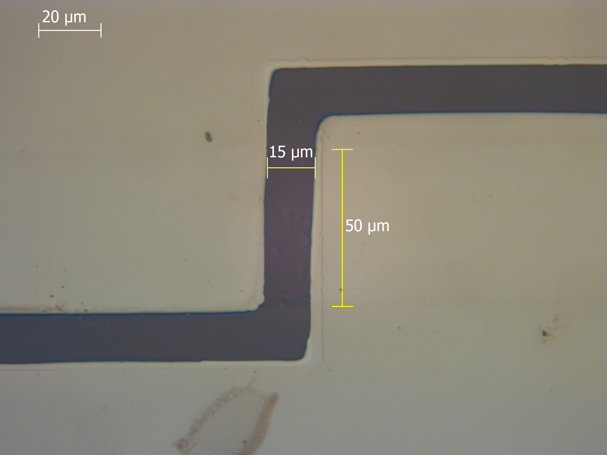

# GFET Fabrication and Characterization Project

This repository documents the fabrication and electrical characterization of a Graphene Field Effect Transistor (GFET). The device was built using photolithography, e-beam PVD metal deposition, and bubbling transfer of CVD-grown graphene.

---

## 📄 Reports

- 📘 [Lab Report (PDF)](Report/Lab_Report_MicroNano.pdf)
- 📊 [Final Presentation (Slides)](Report/LMAN_Presentation_Final.pdf)

---

## 🔬 Microscope Images

### Full Contact View – Device III-25

> Contact pads and channel structure after successful lithography and metal lift-off.

---

### Zoomed-In Graphene Channel

> Channel dimensions: **Length = 15 µm**, **Width = 50 µm**.  
> These dimensions were used in the charge carrier mobility calculation.

---

## 📈 IV Curve – Device III-25

> IV Characteristics measured using KEITHLEY 4200-SCS.  
> Sweep: **Gate Voltage -30V to +70V**, **Drain Bias 0.1V**

**Dirac Point**: VGS ≈ +4V  
**Raw Data File**: [Group_4_S2_III25.xls](Data/Group_4_S2_III25.xls)

---

