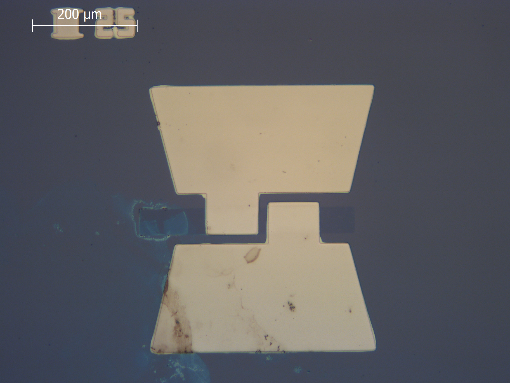
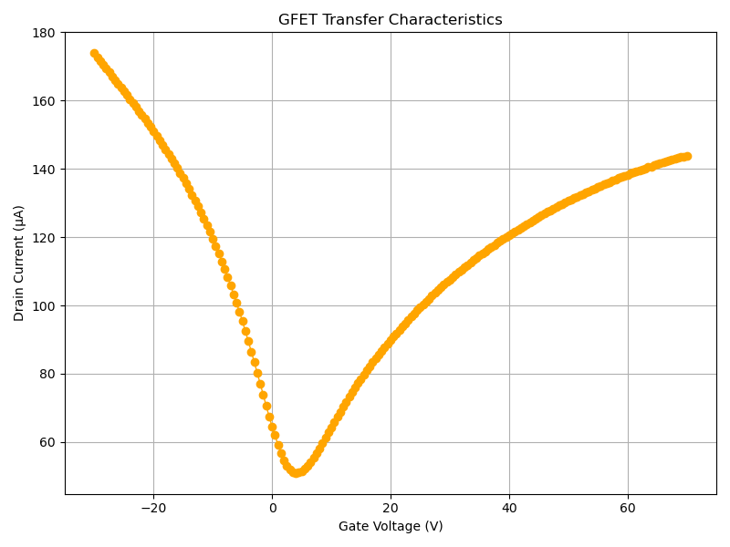

# GFET Fabrication & Characterization Project

This project documents the fabrication and electrical characterization of a Graphene Field-Effect Transistor (GFET). Emphasis is placed on clear data handling, analysis reproducibility, and visualization workflows that reflect good engineering practices. The project combines Excel-based manual charting with Python scripting for automation and repeatability.

The device was fabricated using:

* **Photolithography** for pattern definition
* **E-beam PVD** for metal deposition
* **Bubbling transfer** of CVD-grown graphene onto SiO₂/Si substrates

---

## 📊 Objective

To characterize the transfer curve (Drain Current vs. Gate Voltage) of a fabricated GFET and present the results using both manual and automated analysis methods.

---

## 📄 Reports

* 📘 [Lab Report (PDF)](Report/Lab_Report_MicroNano.pdf)
* 📊 [Final Presentation (Slides)](Report/LMAN_Presentation_Final.pdf)

---

## 🔬 Microscope Images

### Full Contact View – Device III-25


> Contact pads and channel structure after successful lithography and metal lift-off.

### Zoomed-In Graphene Channel


> Channel dimensions: **Length = 15 µm**, **Width = 50 µm**.  
> These dimensions were used in the charge carrier mobility calculation.

---

## 📊 IV Curve – Device III-25


> IV Characteristics measured using KEITHLEY 4200-SCS.  
> Sweep: **Gate Voltage -30V to +70V**, **Drain Bias 0.1V**  
> **Dirac Point**: V<sub>GS</sub> ≈ +4V  
> **Raw Data File**: `Data/IV_Data_Charted.xlsx`

---

## 📊 Excel + Python Visualization

### Excel Workflow

* Drain current was converted from amperes to microamperes
* Plotted in Excel with labeled axes and fine-tuned formatting

### Python Workflow

* Script in `Analysis/plot_iv_characteristics.py`
* Reads data and plots transfer characteristics with Matplotlib

```bash
cd Analysis
python plot_iv_characteristics.py
```

---

### 📊 Final Transfer Curve Plot



---

## 💡 Relevance for Quality/Process Engineering Roles

This project highlights:

* Reproducible workflows using Excel and Python
* Scientific formatting and unit conversions for presentation
* Documentation aligning with traceability and audit-readiness
* Image-supported reporting of physical device metrics
* Familiarity with semiconductor measurement setups

---

## 📂 Folder Structure

```
GFET-Fabrication-Characterization-Project/
├── Data/
│   └── IV_Data_Charted.xlsx (Main)
├── Analysis/
│   └── plot_iv_characteristics.py
├── Images/
│   └── GFET_Top_View.jpg
│   └── GFET_Channel_Dimensions.jpg
│   └── gfet_transfer_plot.png
├── Report/
│   └── Lab_Report_MicroNano.pdf
│   └── LMAN_Presentation_Final.pdf
├── README.md
```

---

## 👤 Author

Mainak Roy


